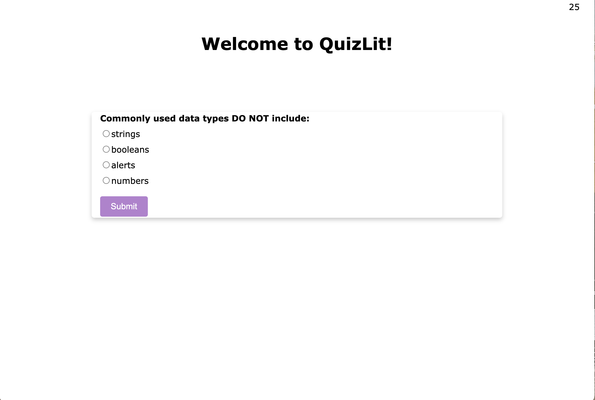

# Challenge-4-repo
This is my assignment for Challenge 4 in which I create a timed quiz program that quizzes the user on JavaScript fundamentals. It has a set time  of 60 seconds for the user to take the quiz. When either the time runs out or the user answers all questions, the user can see their score! This project was quite difficult for me at this point in my coding career, so I sought out support and inspiration from colleagues as well as websites like w3schools.com and codewithfaraz.com.

